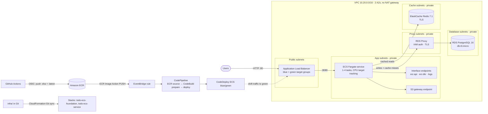

# To-Do App on ECS Fargate with RDS + RDS Proxy + ElastiCache (Redis)

**Live application (ALB endpoint):** http://todo-e-LoadB-YquEy56WAeSL-1254714682.eu-west-1.elb.amazonaws.com

A containerised Java (Spring Boot) To-Do web application on **Amazon ECS Fargate**, inside a custom multi-AZ VPC:
- **Writes** go to **Amazon RDS for PostgreSQL** through **RDS Proxy**. The app authenticates to the proxy with IAM, so it holds no database password.
- **Reads** are accelerated by **Amazon ElastiCache for Redis**.
- Traffic enters through a public **Application Load Balancer**.
- Every image pushed to **Amazon ECR** is rolled out automatically with **blue/green** deployments: EventBridge → CodePipeline → CodeDeploy.
- All infrastructure is **CloudFormation**, deployed with **CloudFormation Git sync**.
- All GitHub Actions access to AWS uses **OIDC**.

```
app/                         Application code (separate from infrastructure)
  src/                         Spring Boot app: UI (Thymeleaf), JPA + Flyway, Redis cache-aside
  Dockerfile                   multi-stage build -> eclipse-temurin 17 JRE, non-root
  docker-compose.yml           local stack: PostgreSQL + Redis + app
infra/                       Infrastructure as code (CloudFormation)
  templates/bootstrap-gitsync-role.yaml   one-time: IAM role used by Git sync
  templates/placeholder.yaml              empty stack Git sync updates into the real stack
  templates/foundation.yaml               VPC, subnets, SGs, VPC endpoints, ECR, RDS, RDS Proxy, Redis, OIDC role
  templates/service.yaml                  ALB, ECS service + auto scaling, CodeDeploy, CodePipeline, EventBridge
  deployments/foundation.yaml             Git sync deployment file -> stack todo-ecs-foundation
  deployments/service.yaml                Git sync deployment file -> stack todo-ecs-service
.github/workflows/
  app-build-push.yml           app/ changed -> mvn verify -> docker build -> push to ECR (OIDC)
  infra-validate.yml           infra/ changed -> cfn-lint + deployment-file checks
docs/architecture.drawio     network architecture diagram (draw.io), also docs/architecture.svg
```

## Architecture

Full network diagram: [docs/architecture.drawio](docs/architecture.drawio). Open it at https://app.diagrams.net. A rendered overview is in [docs/architecture.svg](docs/architecture.svg).



### Network design

| Tier | Subnets (AZ a / AZ b) | Contains | Route table |
|---|---|---|---|
| Public | 10.20.0.0/24, 10.20.1.0/24 | ALB | `0.0.0.0/0` → Internet Gateway |
| App (private) | 10.20.10.0/24, 10.20.11.0/24 | ECS tasks, interface endpoint ENIs | local + S3 gateway endpoint |
| Database (private) | 10.20.20.0/24, 10.20.21.0/24 | RDS PostgreSQL | local only |
| Proxy (private) | 10.20.30.0/24, 10.20.31.0/24 | RDS Proxy | local only |
| Cache (private) | 10.20.40.0/24, 10.20.41.0/24 | ElastiCache Redis | local only |

There is **no NAT gateway**. ECS tasks reach AWS only through VPC endpoints:
- `ecr.api` and `ecr.dkr` for the image manifest;
- the S3 gateway endpoint for image layers;
- `logs` for CloudWatch Logs.

The task role's credentials come from the ECS agent, and IAM tokens for RDS Proxy are signed locally, so no further endpoints are needed. The database, proxy and cache tiers have no route outside the VPC.

### Security groups (one per resource type, least privilege)

| Security group | Inbound | Outbound |
|---|---|---|
| `alb-sg` | 80 from `0.0.0.0/0` | 8080 → `app-sg` |
| `app-sg` (ECS) | 8080 from `alb-sg` | 5432 → `proxy-sg`, 6379 → `cache-sg`, 443 → `endpoints-sg`, 443 → S3 prefix list |
| `endpoints-sg` | 443 from `app-sg` | none |
| `proxy-sg` | 5432 from `app-sg` | 5432 → `db-sg` |
| `db-sg` | 5432 from `proxy-sg` | none |
| `cache-sg` | 6379 from `app-sg` | none |

### How the application uses the data tier

- **Writes → RDS through RDS Proxy.**
  - The app connects with the **AWS Advanced JDBC Wrapper** using `jdbc:aws-wrapper:postgresql://<proxy>:5432/todo?wrapperPlugins=iam&sslmode=require`.
  - The wrapper's IAM plugin uses the **AWS SDK for Java v2** to sign a 15-minute auth token with the ECS **task role**, which is allowed `rds-db:connect` on this proxy and user only.
  - The proxy requires TLS and IAM auth. It logs in to PostgreSQL with credentials from Secrets Manager that the app never sees.
  - Schema changes are versioned with Flyway (`V1__create_tasks.sql`).
- **Reads → Redis (cache-aside)** with Spring Data Redis (Lettuce) over TLS.
  - `GET /` and `GET /tasks/{id}/edit` read Redis first. On a miss they query PostgreSQL through the proxy and cache the result for 5 minutes.
  - Every write evicts the affected keys.
  - If Redis is unavailable, the app falls back to the database.
- **Visible in the UI:** every page shows a badge, either **"Served from Redis cache"** or **"Read from PostgreSQL (RDS Proxy)"**, with the read time. The footer shows the app version (git SHA), the task hostname, the database host (the proxy endpoint) and the cache host.
- **Visible from the API:** `GET /api/tasks` returns the same data as JSON, with an `X-Data-Source: REDIS_CACHE|DATABASE` header.

### Deployment pipeline (blue/green)

1. A push to `app/**` runs [app-build-push.yml](.github/workflows/app-build-push.yml):
   1. `mvn verify` (unit tests);
   2. `docker build`;
   3. assume the `GitHubEcrPushRole` through **OIDC** (trusted only for this repo's `main` branch);
   4. push `todo-app:<sha>`, then `todo-app:latest`.
2. An **EventBridge** rule matches `ECR Image Action` / `PUSH` / `SUCCESS` for `todo-app:latest` and starts **CodePipeline**.
3. The pipeline has three stages:
   - **Source:** the ECR image.
   - **Prepare:** CodeBuild writes `taskdef.json` (the current task definition with the image set to `<IMAGE1_NAME>`) and `appspec.yaml`.
   - **Deploy:** `CodeDeployToECS`.
4. **CodeDeploy** starts a *green* task set with the new image in the green target group. Once it passes the ALB health checks (`/actuator/health/liveness`), CodeDeploy shifts the listener to green, then terminates the blue tasks after 5 minutes.
5. Failures roll back automatically, as does the `UnHealthyHostCount` alarm on the green target group.

### Operations

- Container logs: CloudWatch Logs group `/ecs/todo-ecs-service/todo-app`, with 14-day retention.
- Auto scaling: target tracking on `ECSServiceAverageCPUUtilization` = 60 %, between 1 and 4 tasks (desired 1).
- ALB health check: `/actuator/health/liveness`. It is deliberately not tied to the DB or Redis, so a Redis outage doesn't kill tasks.
- Tags: the Git sync deployment files tag every resource with `Project`, `Environment`, `Owner`, `ManagedBy` and `Stack`.

## Run locally

```bash
cd app
mvn verify                       # unit tests (JDK 17)
docker compose up --build        # PostgreSQL + Redis + app on http://localhost:8080
```

Locally the default Spring profile uses plain PostgreSQL and Redis. In AWS, the `aws` profile switches to RDS Proxy (IAM auth) and ElastiCache (TLS).

## Deploy

### 0. Prerequisites (one-time)

- A **CodeConnections GitHub connection** in eu-west-1 (status *Available*). Its GitHub App installation must include this repository.
- The account's **GitHub OIDC provider** `token.actions.githubusercontent.com` (already present; it is referenced, never created).
- The **Git sync role**, the only stack deployed by hand, because Git sync needs a role before it can sync anything:

```bash
aws cloudformation deploy --region eu-west-1 --stack-name todo-ecs-gitsync-bootstrap \
  --template-file infra/templates/bootstrap-gitsync-role.yaml --capabilities CAPABILITY_NAMED_IAM \
  --parameter-overrides ConnectionArn=<connection-arn>
```

### 1. Foundation stack through Git sync

Git sync configured through the API/CLI only **updates** an existing stack. First create an empty placeholder stack with the right name ([infra/templates/placeholder.yaml](infra/templates/placeholder.yaml) contains only a no-op `WaitConditionHandle`). Git sync then replaces it with the real template, so every real resource is created by Git sync:

```bash
aws cloudformation create-stack --region eu-west-1 --stack-name todo-ecs-foundation   --template-body file://infra/templates/placeholder.yaml
```

Link the repo, then create the sync configuration:

```bash
aws codeconnections create-repository-link --region eu-west-1 \
  --connection-arn <connection-arn> --owner-id Iradukunda54 --repository-name ecs-fargate-todo-rds-redis
aws codeconnections create-sync-configuration --region eu-west-1 --sync-type CFN_STACK_SYNC \
  --resource-name todo-ecs-foundation --branch main --config-file infra/deployments/foundation.yaml \
  --repository-link-id <repository-link-id> --role-arn <GitSyncRoleArn>
```

Git sync creates the stack and redeploys it on every commit that changes the template or the deployment file.

### 2. First image

Set the repository variable `ECR_PUSH_ROLE` to the foundation output `GitHubEcrPushRoleArn`, then run **App - build and push image**:

```bash
gh workflow run app-build-push.yml --ref main
```

### 3. Service stack through Git sync

The ECS service needs an image in ECR before it can start, which is why this stack comes after the first push.

```bash
aws cloudformation create-stack --region eu-west-1 --stack-name todo-ecs-service \n  --template-body file://infra/templates/placeholder.yaml
aws codeconnections create-sync-configuration --region eu-west-1 --sync-type CFN_STACK_SYNC \
  --resource-name todo-ecs-service --branch main --config-file infra/deployments/service.yaml \
  --repository-link-id <repository-link-id> --role-arn <GitSyncRoleArn>
```

The `ApplicationUrl` output is the ALB endpoint.

### 4. Ship changes

- **Application:** push changes under `app/`. GitHub Actions pushes a new image, and EventBridge → CodePipeline → CodeDeploy rolls it out blue/green.
- **Infrastructure:** push changes under `infra/`. Git sync updates the stacks.

> The ECS service uses the `CODE_DEPLOY` deployment controller. After the first deployment, CodeDeploy owns the service's task definition and the listener's target group. Don't change the `TaskDefinition`, `LoadBalancers`, listener default action or target groups in `service.yaml`; ship application changes by pushing an image.

## Verify

```bash
URL=$(aws cloudformation describe-stacks --stack-name todo-ecs-service --region eu-west-1 \
  --query "Stacks[0].Outputs[?OutputKey=='ApplicationUrl'].OutputValue" --output text)
curl -s $URL/actuator/health/liveness            # {"status":"UP"}
curl -si $URL/api/tasks | grep X-Data-Source      # DATABASE on the first read, then REDIS_CACHE
```

| Check | Where |
|---|---|
| App reachable through the ALB | `ApplicationUrl` in a browser: create, edit, complete and delete tasks |
| Reads cached in Redis | Badge on the page: refresh → "Served from Redis cache"; add a task → "Read from PostgreSQL (RDS Proxy)" once, then cached again |
| Writes through RDS Proxy | Footer *database* = `todo-ecs-foundation-proxy.proxy-…`; RDS → Proxies → `todo-ecs-foundation-proxy` → connections |
| ECS tasks healthy | EC2 → Target groups → healthy targets; ECS → cluster → service |
| Logs in CloudWatch | CloudWatch → Log groups → `/ecs/todo-ecs-service/todo-app` |
| Auto scaling 1–4 | ECS → service → *Service auto scaling* (min 1, max 4, CPU 60 %) |
| Blue/green deployment | Change something in `app/` and push. Then watch: GitHub Actions → ECR (new `latest`) → CodePipeline run → CodeDeploy deployment (blue/green) → new version in the page footer |
| Git sync | CloudFormation → stack → *Git sync* tab |

## Deployment evidence

Results of deploying to eu-west-1 from this repository:

| Requirement | Result |
|---|---|
| All resources via CloudFormation Git sync | Stacks `todo-ecs-foundation` and `todo-ecs-service` were synced from `infra/deployments/*.yaml` (CloudFormation → stack → *Git sync*: `SUCCEEDED`) |
| GitHub Actions builds the image and pushes it to ECR with OIDC | Workflow *App - build and push image* pushed `todo-app:<sha>` + `:latest` using `GitHubEcrPushRole` (OIDC, no stored keys) |
| Application reachable through the ALB | The ALB endpoint above serves the UI; `/actuator/health/liveness` → `{"status":"UP"}` |
| ECS tasks pass ALB health checks | The active target group reports `healthy` |
| ECS logs in CloudWatch Logs | `/ecs/todo-ecs-service/todo-app`. Flyway logs `Database: jdbc:postgresql://todo-ecs-foundation-proxy.proxy-…` and `Successfully applied 1 migration`, so writes go through RDS Proxy with IAM auth |
| Reads accelerated by Redis | The page badge and the `X-Data-Source` header: `DATABASE` on a miss, then `REDIS_CACHE` |
| Auto scaling 1–4 on CPU | Scalable target min 1 / max 4 (desired 1), `TargetTrackingScaling` on `ECSServiceAverageCPUUtilization` = 60 |
| EventBridge detects the image push and triggers the pipeline | Pushing commit `a7d3f1a` (header change) started pipeline `todo-ecs-service-Pipeline-…` with trigger type `CloudWatchEvent` (rule `todo-ecs-service-EcrPushRule-…`) |
| Blue/green deployment works | CodeDeploy deployment type `BLUE_GREEN`: the green task set became healthy, the ALB listener moved to the green target group, the live footer changed from version `854803f` to `a7d3f1a`, and the blue tasks were terminated after 5 minutes |
| Tagging | Each stack's resources carry `Project=todo-ecs`, `Environment=dev`, `Owner=Iradukunda54`, `ManagedBy=cloudformation-git-sync`, `Stack=<name>` |

## Cost and teardown

Rough on-demand cost in eu-west-1, with the defaults (single-AZ RDS, Redis without a replica):

| Item | ≈ per hour |
|---|---|
| 3 interface endpoints × 2 AZs | $0.07 |
| RDS Proxy (billed as 2 vCPU for db.t3.micro) | $0.03 |
| ALB | $0.025 |
| Fargate 0.5 vCPU / 1 GB | $0.025 |
| RDS db.t3.micro + 20 GB gp3 | $0.02 |
| ElastiCache cache.t3.micro | $0.02 |
| **Total** | **≈ $0.19/h, about $4.50/day** |

For higher availability:
- set `DbMultiAZ: "true"` (RDS standby, about +$0.02/h);
- set `CacheReplicas: "1"` (Redis replica with automatic failover, about +$0.02/h).

Both settings are in [infra/deployments/foundation.yaml](infra/deployments/foundation.yaml).

Teardown, in this order:
1. Delete the Git sync configurations.
2. Empty the pipeline artifact bucket, then delete the `todo-ecs-service` stack.
3. Delete the `todo-ecs-foundation` stack. ECR images are removed with it (`EmptyOnDelete`), and RDS leaves a final snapshot (`DeletionPolicy: Snapshot`).
4. Delete `todo-ecs-gitsync-bootstrap`.
